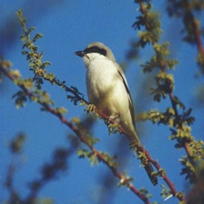
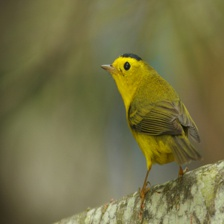
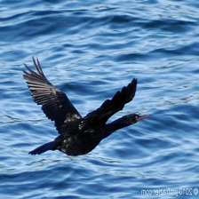

# Show and Tell in PyTorch
PyTorch implementation of [Show and Tell: A Neural Image Caption Generator](https://arxiv.org/abs/1411.4555) which introduce CNN-RNN based caption generation model. Unlike to the original paper, the model is trained and visualized upon on the CUB-200-2011 dataset.

## Getting Started
#### Dataset
Download [CUB](http://www.vision.caltech.edu/visipedia/CUB-200-2011.html) dataset and extract it to the `data_root` directory as below. (default `data_root` is `./data`)

```shell
cd ./data
sh ./download.sh
```

#### Train the model
This model uses ResNet-50 as a encoder and utilize GloVe word embedding layer. Fortunately, model preparation is done automatically, but downloading the GloVe seems to be slow.

Text preparation such as tokenization, padding or numericalization are performed on-the-fly (see `dataset.py`). So, to train the model, just run below code.

```shell
python train.py
```

#### Test or visualize model
Please see `visualize.ipynb`.

## Results
**Generated:**  a white bird with grey wings and an orange bill. <br>


**Generated:**  this is a bird with a white belly and grey wings. <br>


**Generated:**  the small yellow bird has black wings and a yellow eyebrow. <br>


**Generated:**  this is a large, all black bird with a blunt, wide beak, large black wings, long black tail and black head. <br>

