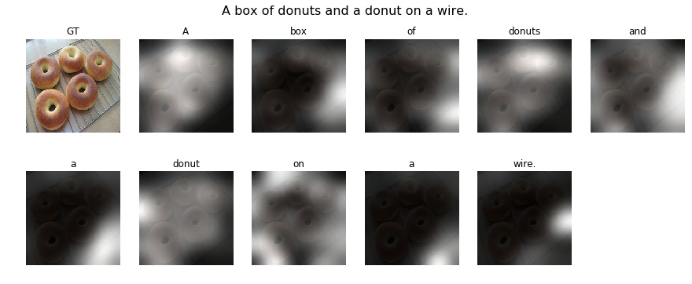
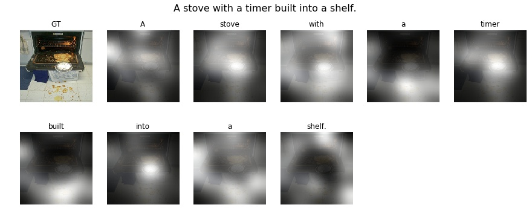
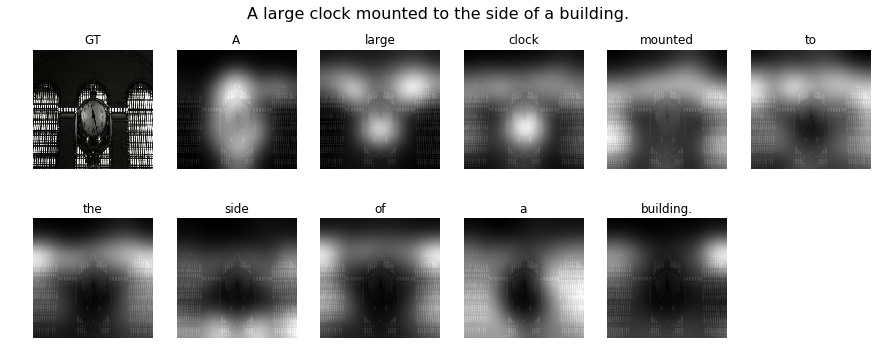
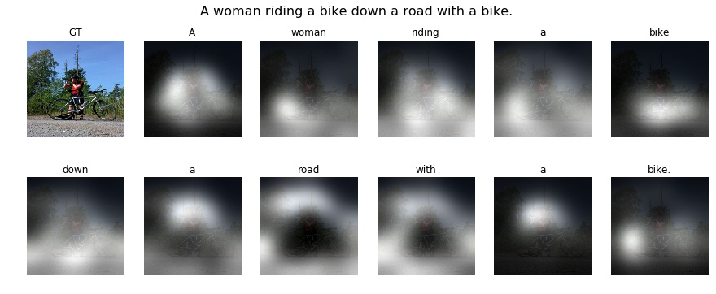

# Show Attend and Tell in PyTorch
PyTorch implementation of [Show, Attend and Tell: Neural Image Caption Generation with Visual Attention](https://arxiv.org/abs/1502.03044) which introduce attention mechanism on the caption generation task.

## Getting Started
#### Dataset
1. Download [MS COCO](http://cocodataset.org) dataset and extract it to the `data_root` directory (default `data_root` is `./data`). Dataset has to be placed as below.

```shell
data    
├── annotations
|   ├── captions_train2014.json
|   └── captions_val2014.json
├── train2014
|   └── images....
└── val2014
    └── images....
```

Then, please prepare the [cocoapi](https://github.com/cocodataset/cocoapi). Before installing it, Cython package has to be installed.
```shell
pip install Cython

git clone https://github.com/cocodataset/cocoapi
cd coco/PythonAPI/

make
python setup.py build
python setup.py install
```

**NOTE:** To compile cocoapi in Python3, you must modify line 3 in `coco/PythonAPI/MakeFile` to,
```
python3 setup.py build_ext --inplace
```

#### Train the model
This model uses VGG-19 as a encoder and utilize GloVe word embedding layer. Fortunately, model preparation is done automatically, but downloading the GloVe seems to be slow.

Text preparation such as tokenization, padding or numericalization are performed on-the-fly (see `dataset.py`). So, to train the model, just run below code.

```shell
python train.py
```

#### Test or visualize model
Please see `visualize.ipynb`.

## Results




