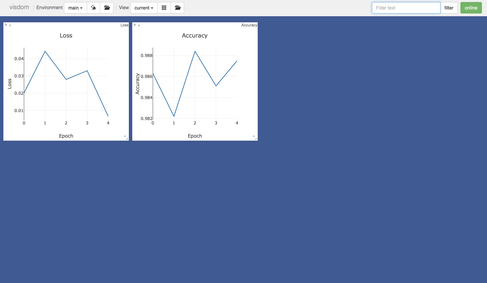

# PyTorch Utilities
Tensorflow and Keras have their own powerful API to visualize the model or logs (mainly by the tensorboard), but PyTorch doesn't have comparable API yet. So in this exercise, I want to introduce two convenient package Visdom and torchsummary to visualize model and logs.

## Installation
```shell
pip install visdom torchsummary
```

## Getting Started
The torchsummary package automatically shows the summary of model. However to visualize log plot by visdom, you have to run visdom sever before running this code.
```shell
python -m visdom.server
```
Results are as below.

#### torchsummary

```
----------------------------------------------------------------
        Layer (type)               Output Shape         Param #
================================================================
            Conv2d-1           [-1, 32, 28, 28]             320
       BatchNorm2d-2           [-1, 32, 28, 28]              64
              ReLU-3           [-1, 32, 28, 28]               0
         MaxPool2d-4           [-1, 32, 14, 14]               0
            Conv2d-5           [-1, 64, 14, 14]           18496
       BatchNorm2d-6           [-1, 64, 14, 14]             128
              ReLU-7           [-1, 64, 14, 14]               0
         MaxPool2d-8             [-1, 64, 7, 7]               0
            Linear-9                   [-1, 10]           31370
================================================================
Total params: tensor(50378)
Trainable params: tensor(50378)
Non-trainable params: tensor(0)
----------------------------------------------------------------
```

#### Visdom


## Reference
- [Visdom](https://github.com/facebookresearch/visdom)
- [torchsummary](https://github.com/sksq96/pytorch-summary)
